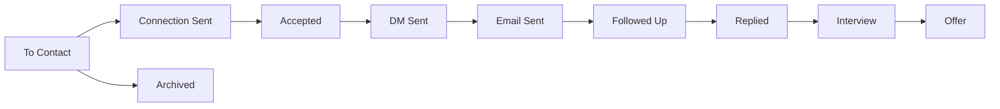

# AI Product Engineer Cold Outreach & Conversion Playbook

**Target Candidate:** Kumar Nalin (AI & Data Science, USAR 2027)  
**Target Roles:** AI Product Engineer / Full-Stack AI Engineer (Internship now, 12+ LPA FT path)  
**Primary Tracker:** [`company_directory_viewer.html`](file:///d:/jobsearch/company_directory_viewer.html) (Pure neutral grayscale workbench)  
**Audited Dataset:** 355 Seed-to-Series B AI startups (<100 employees, India-eligible)  
**Last Updated:** October 2026

---

## 1. Executive Summary & Audited Dataset Architecture

The outreach system consists of 355 thoroughly vetted and verified AI product startups across India (Delhi-NCR, Bengaluru, and Remote). Every single record has undergone automated live HTTP verification and manual schema enforcement:

- **Total Startups:** 355
- **Live Active Websites:** 352 HTTP 200 OK | 3 Protected/WAF (403) | 0 Dead / Squatted / 404s
- **Verified Careers Portals:** 240 live dedicated career pages
- **Stage Screen:** Strictly Seed to Series B, <100 headcount, vetted for active 2025–2026 operations
- **Geographic Breakdown:** 149 Delhi-NCR eligible (42%) | 295 Remote eligible (83%) | 0 non-India companies

All company replacements (replacing legacy oversized, acquired, or dead companies such as Dyte, Cacheflow, Togai, Neon, Highlight.io, Codeium, Protect AI, Phidata, Keywords AI, Factory.ai, Memfold, and Invoid) have been finalized with high-growth startups from Y Combinator (W24–W26), Peak XV Surge, Accel Atoms, and Together Fund.

---

## 2. Scoring & Tiering System

Rather than relying on an arbitrary 5-company hardcoded filter, all 355 companies are evaluated and ranked across **5 distinct dimensions** (0–5 scale each), yielding a composite score out of 25:

### The 5 Scoring Dimensions (0–5 Scale)

1. **Product & Tech Stack Fit (0–5):**
   - Direct alignment with your core stack: AI/LLM orchestration, Next.js/React, FastAPI/Python, LangGraph, RAG vector retrieval, and AST static analysis.
   - *5:* Core AI/LLM developer tool, agent framework, or observability platform.
   - *3–4:* AI-powered vertical SaaS or conversational agent platform.
   - *1–2:* Peripheral AI wrapper or traditional software.
2. **Hiring Signal (0–5):**
   - Active hiring indicators: open engineering internships, recent YC/Surge funding rounds, fresh 2025–2026 launches on Product Hunt or GitHub.
   - *5:* Active open internship/SDE listing or funded within last 6 months.
   - *3–4:* Steady growth and recent product launches.
3. **India Eligibility (0–5):**
   - Geographic preference: Delhi-NCR presence or seamless remote hiring for Indian engineers.
   - *5:* Delhi-NCR office/hybrid (Noida, Gurugram, New Delhi).
   - *4:* Fully remote India-wide or Bengaluru with remote team members.
   - *3:* India entity established.
4. **Warm Path Feasibility (0–5):**
   - Network proximity: Open-source contribution pathway, YC founder batchmate link, or alumni/1st-degree connection.
   - *5:* Open-source repo where a PR can be submitted (Langfuse, Mem0, LiteLLM, Composio, etc.) or direct founder link.
   - *3–4:* Mutual accelerator or investor cohort (Surge, Atoms, Together Fund).
5. **Compensation Likelihood (0–5):**
   - Ability to pay market-rate stipends for internships and meet the 12+ LPA target for early-career full-time conversions.
   - *5:* Series A/B funded ($5M–$25M) or top-tier Seed ($2M+) backed by tier-1 VCs.
   - *3–4:* Seed funded ($500K–$2M).

### Operational Tiers

- **Tier A (Top 40 Startups | Scores 23–25/25):**  
  *Strategy:* **Deep Personalization & Warm Paths.** Every outreach requires a bespoke observation, an open-source PR or 1–2 hour micro-demo, and warm introductions where possible.
- **Tier B (~100 Startups | Scores 20–22/25):**  
  *Strategy:* **Semi-Personalized Outreach.** High-efficiency outreach combining the structured 80–120 word template with one verified technical observation. Maximum 5 minutes spent per prospect.
- **Tier C (215 Startups | Scores 15–19/25):**  
  *Strategy:* **Reserve / Drip Pipeline.** Kept in reserve. Activated in controlled weekly drips or when new hiring signals (funding, launch) trigger a tier upgrade.

---

## 3. Tracker Architecture & Workbench Operations

The upgraded workbench in [`company_directory_viewer.html`](file:///d:/jobsearch/company_directory_viewer.html) provides an integrated CRM and drafting desk:

### 10-Stage Pipeline Lifecycle

1. **To Contact:** Prospect identified and researched.
2. **Connection Sent:** LinkedIn connection invite dispatched (free 200 / premium 300 char note). Follow-up date auto-set to +7 days.
3. **Accepted:** Connection accepted. Signals window for non-pitch value DM.
4. **DM Sent:** Value observation or 30s demo sent on LinkedIn. Follow-up auto-set to +5 days.
5. **Email Sent:** 80–120 word targeted cold email sent. Follow-up auto-set to +5 days.
6. **Followed Up:** Day 5–7 fresh angle follow-up dispatched.
7. **Replied:** Dialogue initiated; conversation in progress.
8. **Interview:** Screening call, technical interview, or take-home project scheduled.
9. **Offer:** Offer received (stipend or 12+ LPA full-time path).
10. **Archived:** Not hiring currently, rejected, or paused.

### Core Data Fields & Automated Date Stamping

- **Contact Metadata:** `contact_name`, `contact_role`, `linkedin_url`, `contact_email_source`, `warm_intro_path`, `tier`, `total_score`.
- **Automated Lifecycle Dates:**
  - `connection_sent_date`: Auto-stamped when marked sent.
  - `connection_accepted_date`: Stamped upon acceptance.
  - `dm_sent_date`: Stamped when LinkedIn DM sent.
  - `email_sent_date`: Stamped when email sent.
  - `followup_due_date`: Automatically calculated (+7 days for invites, +5 days for emails/DMs).
  - `last_touched_date`: Stamped on any activity to calculate staleness.

### The "Today" Operational View

Clicking the **"Today (Follow-ups Due)"** filter button surfaces:
1. Startups with `followup_due_date <= today`.
2. Startups in active pipeline (`Connection Sent`, `DM Sent`, `Email Sent`, `Followed Up`) where `last_touched_date >= 5 days` without a reply.

### Data Persistence & Weekly Backup Protocol

Browser `localStorage` is vulnerable to browser cache clears or device changes. The top header provides **1-Click Export & Import**:
- **Export JSON:** Full state backup capturing all notes, dates, and stage history into `jobsearch_tracker_backup_YYYY-MM-DD.json`.
- **Export CSV:** Synchronized tabular export for Google Sheets or Excel tracking.
- **Import Backup:** Restores 100% of pipeline state and notes with one file selection.
- *Rule:* **Export a JSON backup every Sunday evening.**

### List Management & Editing (Full CRUD Architecture)

The workbench supports full dynamic list editing directly in the interface without manual code edits:
- **`+ Add Company` Modal:** Located in the top header. Allows adding newly sourced startups with company name, website, sector, location, team size, funding, contact details, custom hook, 5-dimension fit scores, tier, and initial pipeline stage. Automatically generates a unique ID, prepends the record to your active directory, and recalculates all metrics and filter pill counts.
- **`Edit` Company Details:** Available directly on every table row and in the Workbench modal header (`Edit Details`). Lets you modify any contact fact, email, LinkedIn URL, pitch hook, or 5-dimension score in real time. The score sum and recommended tier update dynamically as you tweak the sliders/inputs.
- **`Delete` Company:** In edit mode, an option to delete a company allows removing obsolete, paused, or non-compliant targets with one confirmation prompt.
- **`Reset List`:** Reverts local modifications back to the original verified 355-startup dataset if needed.
- **Two-Way Synchronization:**
  - *Browser $\rightarrow$ Disk:* Click **"Export JSON"** to download the clean `companies_data.json` containing all added/edited companies and tracking dates.
  - *Disk $\rightarrow$ Pipeline:* If you edit `companies_data.json` in your code editor, run `python scripts/sync_data.py` to automatically update `target_companies.csv` and regenerate the viewer in one command.

### Conversion Analytics Dashboard

Clicking **"Analytics"** opens a live conversion modal calculating:
- **LinkedIn Acceptance Rate:** $\frac{\text{Accepted}}{\text{Connection Sent}} \times 100$
- **Cold Email Reply Rate:** $\frac{\text{Replied (Email)}}{\text{Email Sent}} \times 100$
- **LinkedIn DM Reply Rate:** $\frac{\text{Replied (DM)}}{\text{DM Sent}} \times 100$
- **Interview Conversion Rate:** $\frac{\text{Interviews}}{\text{Total Replies}} \times 100$
- **Breakdown by Tier:** Granular conversion table tracking Tier A vs. Tier B vs. Tier C reply velocity.

---

## 4. Continuous Startup Sourcing Channels

Maintain an active pipeline by sourcing **5–10 new companies weekly**, retiring non-responsive ones, and updating funding rounds:

1. **YC Work at a Startup & Wellfound:**
   - Filter criteria: Seed to Series B, team size $\le 50$, roles: "Software Engineer", "AI Engineer", "Internship", or "New Grad".
   - Look specifically for founders who review applications directly.
2. **Hacker News "Who is Hiring?":**
   - Released on the 1st of every month at 11:00 AM ET.
   - Ctrl+F search: `Remote`, `India`, `Python`, `Next.js`, `FastAPI`, `AI`, `LLM`.
   - Founders and lead engineers posting directly here have a 3x higher response rate.
3. **Accelerator Cohorts & Tier-1 Portfolio Pages:**
   - Check current batch directories every quarter:
     - **Peak XV Surge:** [surgeahead.com](https://www.surgeahead.com)
     - **Accel Atoms:** [atoms.accel.com](https://atoms.accel.com)
     - **Together Fund:** [together.fund](https://together.fund)
     - **Lightspeed India:** [lsip.com](https://lsip.com)
     - **Blume Ventures:** [blume.vc](https://blume.vc)
4. **Product Hunt & YC Launch Posts (Last 30 Days):**
   - Monitor the Product Hunt leaderboard and `ycombinator.com/launches`. Fresh launches mean immediate engineering bottlenecks and urgent hiring needs.
5. **GitHub Repos (500–5,000 Stars in AI/Devtools):**
   - Repos in this range typically have 3–15 core maintainers who are actively funded and looking for high-velocity contributors.

---

## 5. Warm Paths & Network Activation Playbook

Cold outreach is powerful, but warm pathways convert at 4–5x the rate. Execute these before cold messaging:

### 1. 900+ LinkedIn Network Audit
- Go to LinkedIn Settings $\rightarrow$ Data Privacy $\rightarrow$ Get a copy of your data $\rightarrow$ Connections.
- Filter the CSV against company names in your Tier A and Tier B lists.
- Flag 1st-degree connections and alumni from USAR / GGSIPU in the tracker.

### 2. YC Founder Batchmate Outreach (~10 Contacts)
Do not ask for a job directly. Ask for intelligence and forwardable recommendations:
> *"Hey [Name], loved seeing [Company]'s progress with [recent feature/milestone]! Quick question—which of your batchmates are currently hiring engineers who ship fast? I recently optimized an LLM pipeline from 317s to 117s at NimitAI and would love to help an early-stage team. Happy to send a 3-line forwardable blurb if anyone comes to mind."*

**Forwardable 3-Line Blurb:**
> *Kumar Nalin — Final-year AI/DS student at USAR. Shipped NimitAI (cut LLM latency 317s $\rightarrow$ 117s, Azure DB migration), Notovo (agentic memory), and Code Sage (AST code audit). Seeking AI product engineering internship / early-career role: [kumarnalin.me](https://kumarnalin.me) | [github.com/nalin](https://github.com/nalin)*

### 3. The "10-Minute Technical Opinion" for 1st-Degree Connections
Reach out to senior engineers or founders in your network asking for product/architecture feedback, never a job:
> *"Hey [Name], saw your work on [their tech area]. I recently built an AST-driven codebase audit engine (Code Sage) and would value 10 minutes of your critique on our AST node indexing approach. No job ask—just looking to learn from your architecture choices."*

---

## 6. Proof-in-Public & Pre-Outreach Evidence

Proof beats resumes. Before reaching out to Tier A companies, establish public proof:

### Open-Source Contributions as Cold Outreach
For developer tool and infra companies, a merged pull request is the highest-converting icebreaker in tech:
- **Langfuse:** Submit an issue fix or telemetry helper PR.
- **Dub.co:** Contribute a link routing or edge analytics optimization.
- **Mem0:** Add an embedding provider integration or memory search benchmark.
- **LiteLLM:** Add an error-handling wrapper or router fallback test.
- **Composio / Trigger.dev / Dify / Flowise:** Build an integration tool or action.

*In your outreach, simply state:*
> *"Saw issue #142 around stream buffer latency—just submitted PR #145 addressing the queue flush. Loved working with the codebase."*

### 1–2 Hour Micro Demos for Top 10 Prospects
Build a hyper-focused UI or extension and send a 30-second Loom or Vercel link:
- A custom trace viewer dashboard for an observability company.
- A fast keyboard-shortcut navigation prototype for a productivity tool.
- A benchmark test script testing latency across edge endpoints.

### Unified Online Narrative
Ensure your **Portfolio**, **GitHub pinned repositories**, and **LinkedIn headline** tell one coherent, punchy story:
- **Headline:** *AI Product Engineer · Shipped NimitAI (317s $\rightarrow$ 117s), Notovo, Code Sage · Next.js, FastAPI, LangGraph*
- **Featured Projects:**
  1. **NimitAI:** High-throughput LLM pipeline optimization (63% latency cut), PostgreSQL Azure migration.
  2. **Code Sage:** AST-driven static analysis and agentic code audit engine.
  3. **Notovo:** LangGraph persistent memory and AI note synthesis engine.

---

## 7. LinkedIn Connection Notes & DM Masterclass

### Character Limits & Guardrails
- **Free LinkedIn Accounts:** Strict **200 character** limit on connection notes.
- **LinkedIn Premium:** **300 character** limit.
- *Tracker Feature:* The outreach desk includes a Free vs. Premium toggle with live character counting and warning indicators.

### Note Formula: Observation + Proof + Zero Pitch
Never pitch in the connection request. Keep it clean:

**Free Account Formula ($\le 200$ chars):**
> *Hi [Name], saw [Company]'s [feature] and [observation]. At NimitAI I cut LLM pipelines 317s->117s. Open to connecting?*

**Premium Account Formula ($\le 300$ chars):**
> *Hi [Name], saw [Company]'s [feature] and [observation]. I build AI products end to end; at NimitAI I cut LLM pipelines from 317s to 117s. Open to connecting about intern / new-grad opportunities?*

### First DM After Acceptance (No Pitch!)
Do not immediately pitch upon acceptance. Share one useful observation or ask a small, low-friction question:
> *Thanks for connecting, [Name]! Really impressed by [Company]'s work on [feature].*  
> *I built Code Sage (AST code audit engine) and reduced LLM pipeline latency 317s $\rightarrow$ 117s at NimitAI.*  
> *Are you taking on interns or early engineers this quarter, or is it too early?*

### Daily Pacing & Safety
- **Pacing Limit:** 15–20 connection requests per day maximum. Exceeding this risks LinkedIn shadowbans or account restrictions.
- **Company Rule:** Never reach out to multiple founders/engineers at the same startup within the same week.

---

## 8. High-Conversion Cold Email Engine

### Core Email Structure (80–120 Words)
- **Subject:** `Quick idea for {Company}'s {feature}` (short, lowercase/natural, specific).
- **Body:**
  - Lead with the product, not yourself.
  - One concrete technical observation.
  - One proof sentence with real numbers.
  - One low-friction ask ("taking interns?" beats "15-min call").
  - Clean signature (link to portfolio & GitHub; **no phone numbers or corporate clutter**).

### Cold Email Template

**Subject:** Quick idea for {Company}'s {feature}

> Hi {Name},
>
> I was using {Company}'s {feature} and noticed {one real observation}.
>
> I'm Nalin, a final-year AI/DS student who recently {tailored proof snippet}. I'd love to help {Company} with {specific technical area}.
>
> Are you taking interns or early engineers? If it's not the right time, no worries, and I'll happily send a short writeup of what I'd build.
>
> Nalin | kumarnalin.me | github.com/nalin

### Proof Snippet Matrix by Company Type

| Company Domain | Recommended Proof Snippet |
| :--- | :--- |
| **LLMOps, Infra, Latency** | *"cut an LLM pipeline from 317s to 117s (63% reduction) and migrated 20GB+ production data at NimitAI"* |
| **Developer Tools, Code Analysis** | *"built Code Sage, an AST-driven static analysis engine for automated code quality and security audits"* |
| **Agents, Memory, Productivity** | *"built Notovo, an agentic memory and structured note synthesis engine powered by LangGraph"* |
| **Search, Vectors, RAG** | *"built high-throughput multi-modal retrieval pipelines with sub-second vector search indexing"* |
| **Voice, Audio, Telephony** | *"built full-stack speech analysis and TTS pitch workflows for Prep War Room"* |

### Follow-up Protocol (Day 5–7)
Never send "just bumping this" or "circling back." Send a 2-sentence note with a fresh update:

**Subject:** Re: Quick idea for {Company}'s {feature}

> Hi {Name},
>
> Wanted to share a quick update—I just open-sourced a new optimization pipeline for {feature}.
>
> Would love to share a 2-minute demo if you're exploring early engineering or intern support this quarter.
>
> Best,  
> Nalin

- **Timing:** Send Tuesday to Thursday mornings between 8:30 AM and 10:30 AM in the recipient's local time zone.

---

## 9. Execution Habits & Operating System

### Daily Outreach Timeblock (60–75 Minutes)
Every morning, execute this structured block:
1. **10 New LinkedIn Connection Requests:** Personalized notes sent to Tier A & B founders/leads.
2. **5 Value DMs:** Sent to newly accepted LinkedIn connections.
3. **5 Targeted Cold Emails:** 80–120 word emails to decision-makers.
4. **Clear Follow-ups Due:** Address all follow-ups flagged in the workbench's "Today" view.

### Weekly Sunday Conversion Review
- Export JSON & CSV backup.
- Review conversion dashboard: Which subject line had the highest open rate? Which tier had the highest response?
- Implement **exactly one change per week** (e.g. testing a new subject line or proof angle) to isolate what drives conversion gains.

### Personalization Cost Guardrails
- **Tier A:** Spend 15–20 minutes (deep research, open-source issue review, demo).
- **Tier B:** Strictly $\le 5$ minutes (feature observation + template + proof selector). If a Tier B email takes longer than 5 minutes, simplify.
- **Tier C:** Kept in reserve.

### Double-Path Strategy
Always apply through the official careers portal or ATS (Ashby, Greenhouse, Lever), then reference it in your direct outreach:
> *"I also formally applied via your jobs page, but wanted to share a concrete observation directly with the engineering team."*

### Reply Readiness Toolkit
Before receiving a reply, have these assets ready on hand:
1. **1-Page Tailored Resume:** Clean PDF hosted on a permanent URL (`kumarnalin.me/resume.pdf`).
2. **2-Minute Demo Video:** Unlisted Loom demo walking through NimitAI pipeline optimization or Code Sage AST engine.
3. **Salary Expectations Answer:** Prepared script: *"For a full-time role my target is 12+ LPA; for an immediate internship, I am open to standard funded stipend rates as long as the work involves high-ownership engineering."*
4. **Roadmap Inquiry:** 3 thoughtful technical questions regarding their scaling hurdles, inference costs, or agent evaluation strategies.
5. **Strict Compliance:** Never scrape LinkedIn or use unauthorized mass email bots. High-conviction, personalized outreach preserves your reputation and ensures maximum conversion.
